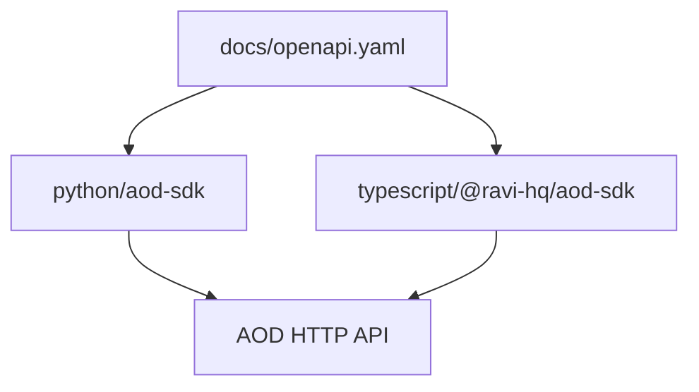

# Clients Package

`clients` contains the official SDKs. They expose the same AOD REST concepts
as language-native clients.

## Index

- [`python/`](python/README.md) is the published `aod-sdk` package.
- [`typescript/`](typescript/README.md) is the published
  `@ravi-hq/aod-sdk` package.

Skip `.venv`, `dist`, caches, and generated declaration output.
