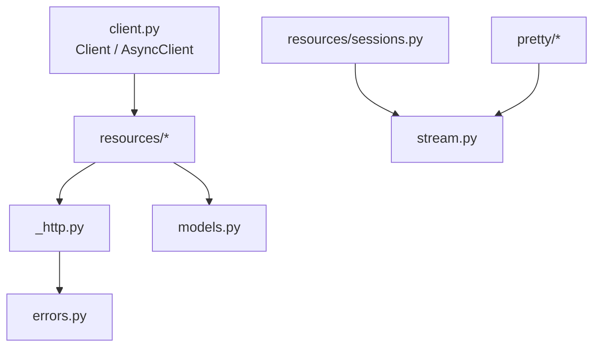

# Python SDK Source

This package is the implementation of `aod-sdk`. It offers sync and async
clients, pydantic models, typed errors, SSE helpers, and optional runtime
pretty-printers.

## Files

- `__init__.py` is the public import surface and version source.
- `client.py` resolves config and mounts resource clients.
- `_http.py` centralizes httpx client creation, headers, JSON parsing, and
  error checks.
- `errors.py` maps HTTP statuses to typed SDK exceptions.
- `models.py` defines pydantic response and input models.
- `stream.py` parses SSE data lines into `StreamEvent` models.
- [`resources/`](resources/README.md) maps REST resources to client methods.
- [`pretty/`](pretty/README.md) contains runtime-specific display helpers.

## Index

- [`resources/`](resources/README.md) — agents, environments, and sessions
   resource clients.
- [`pretty/`](pretty/README.md) — optional runtime-specific display helpers.
