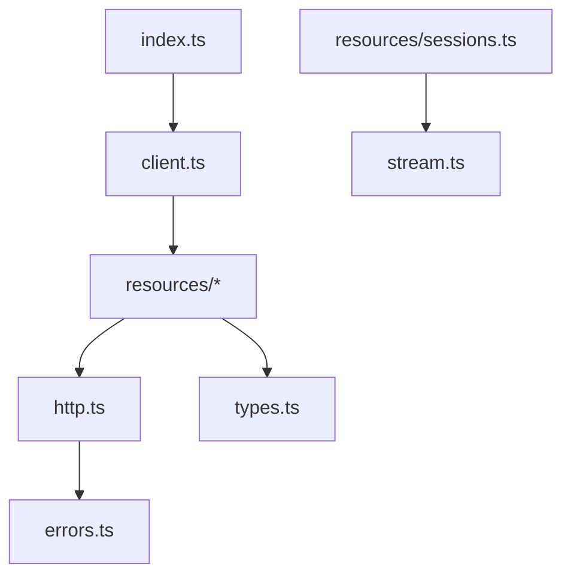

# TypeScript SDK Source

This package is the implementation of `@ravi-hq/aod-sdk`. It is a zero-runtime
dependency SDK built around `fetch` and async iterables.

## Files

- `index.ts` is the public export surface.
- `client.ts` resolves config and exposes `agents`, `environments`, and
  `sessions`.
- `http.ts` wraps `fetch`, timeouts, headers, JSON parsing, and error mapping.
- `errors.ts` defines typed SDK exceptions.
- `types.ts` defines API response and stream event types.
- `stream.ts` turns SSE responses into `AsyncIterable<StreamEvent>` handles.
- `version.ts` feeds package/version headers.
- [`resources/`](resources/README.md) maps REST resources to methods.

## Index

- [`resources/`](resources/README.md) — agents, environments, and sessions
   resource clients.
