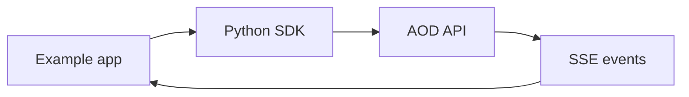

# Examples Package

Examples show how products should compose the SDKs around real workflows.

## Index

- [`cli/`](cli/README.md) is a terminal wrapper that creates/reuses an
  environment and agent, starts a session, and streams formatted output.
- [`chat-bot/`](chat-bot/README.md) demonstrates a Slack mention bot with
  multi-turn sessions.
- [`dashboard/`](dashboard/README.md) demonstrates a FastAPI web dashboard with
  an SSE proxy.
- [`batch-automation/`](batch-automation/README.md) demonstrates concurrent
  async sessions from a prompt list.

## Pattern

Read examples after the SDK and server package chapters; they are integration
recipes, not core library code.
