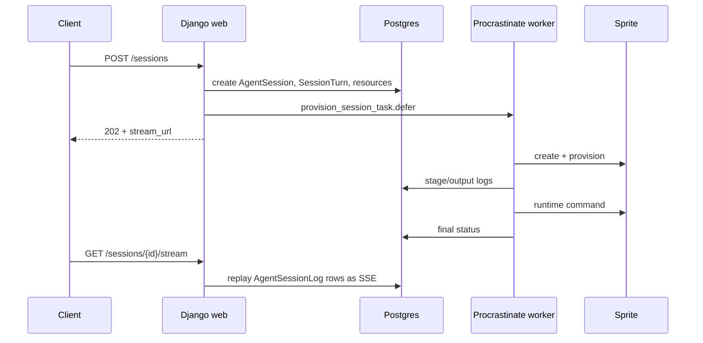

# Agent on Demand Source

`src` contains the Django project and application code for AOD. The service is
an execution plane: the web process creates durable rows and enqueues work; the
worker provisions a Sprite, runs the runtime CLI, persists logs, and updates
session state.

## Index

- [`config/`](config/README.md) is the Django project wrapper.
- [`agent_on_demand/`](agent_on_demand/README.md) is the API, models,
  validation, runtime, and worker package.

Skip migrations and static/template assets on a first read. The architectural
chapters are models, views, runtimes, session service, validation, and stream.
