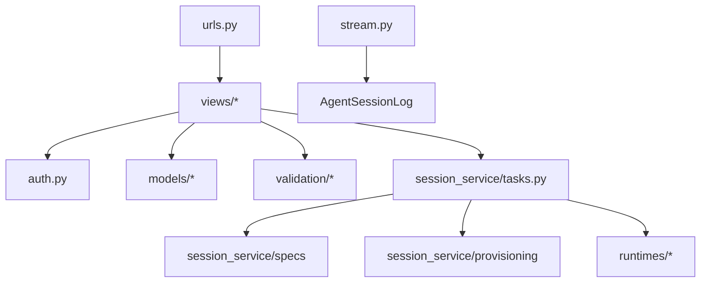

# Agent On Demand Package

This is the Django app. It owns API authentication, resource models, REST
views, validation, runtime adapters, streaming, and worker tasks.

## Index

- [`models/`](models/README.md) for the durable product model.
- [`views/`](views/README.md) for the REST API.
- [`session_service/`](session_service/README.md) for provisioning and turn
   execution.
- [`runtimes/`](runtimes/README.md) for CLI command/config adapters.
- [`validation/`](validation/README.md) for request-shape guards.
- [`ui/`](ui/README.md) for the built-in operator UI.

`stream.py` and `stream_format.py` are important root files, but they do not
have a child README because they are a two-file SSE replay surface.

## Root Files

- `auth.py` implements bearer API-key auth for sync and async views.
- `apps.py` registers startup hooks: signals, OpenTelemetry, PostHog, and
  SQLite test pragmas.
- `crypto.py` encrypts stored user credentials.
- `observability.py` configures OpenTelemetry and library instrumentation.
- `session_state.py` centralizes allowed session lifecycle transitions.
- `tasks.py` imports worker tasks so Django/Procrastinate can discover them.
- `versioning.py` handles optimistic concurrency checks.
- `admin.py` and [`ui/`](ui/README.md) serve the built-in operator UI.
