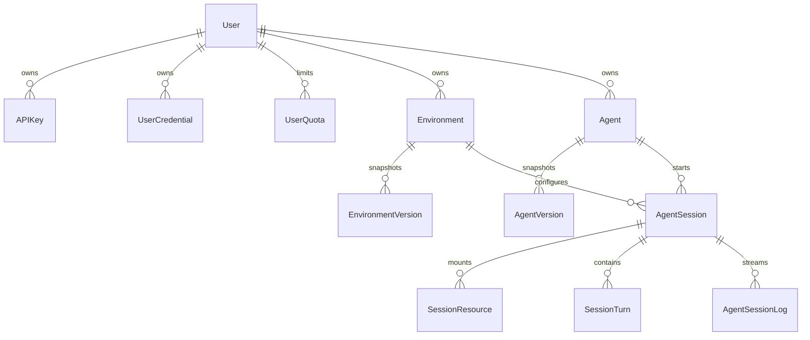

# Models Package

The model package is the durable product contract. The REST API is thin enough
that understanding these rows explains most behavior.

## Files

- `auth.py` defines `APIKey` and encrypted `UserCredential` rows.
- `quota.py` defines per-user concurrent session limits.
- `environments.py` defines reusable setup plus immutable snapshots.
- `agents.py` defines runtime/model/system/tool config plus immutable
  snapshots.
- `sessions.py` defines execution rows: sessions, mounted resources, turns,
  and log chunks.
- `__init__.py` re-exports the public model set for imports.

## Key Ideas

- Agents and environments are mutable rows with version snapshots.
- Sessions are immutable enough to replay: prompt, runtime, backend handle,
  resources, turns, and logs capture the execution.
- `AgentSessionLog` is both audit trail and SSE source.
