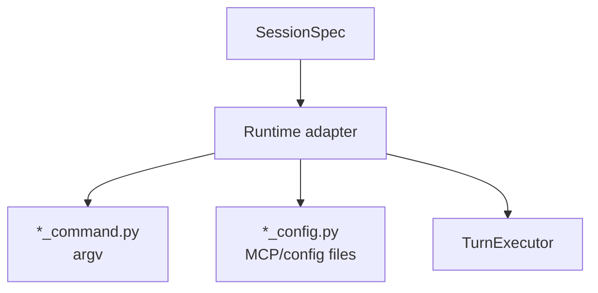

# Runtimes Package

Runtime adapters translate a `SessionSpec` into CLI config and commands for
Claude, Codex, Gemini, and opencode. The worker does not know CLI-specific
flags directly; it asks the runtime adapter.

## Files

- `base.py` defines the runtime protocol.
- `__init__.py` registers runtime names to adapters.
- `claude.py`, `codex.py`, `gemini.py`, `opencode.py` implement runtime
  adapters.
- `*_command.py` builds per-runtime argv for first turns and continuation
  turns.
- `*_config.py` renders MCP/runtime config files.
- `claude_otel.py` builds Claude-specific telemetry environment variables.

## Extension Checklist

To add a runtime, define a runtime class, command builder, config rendering if
needed, model provider compatibility, and tests for argv/config behavior.
