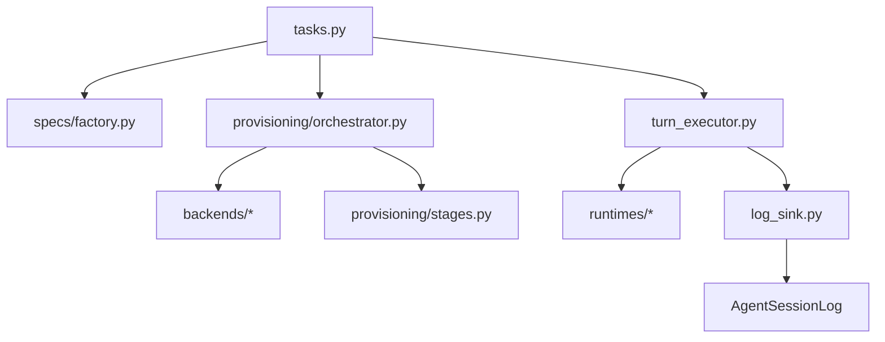

# Session Service Package

This package is the execution engine. It turns database sessions into backend
sessions, provisions them, runs runtime CLIs, persists log chunks, and performs
cleanup.

## Files

- `tasks.py` defines Procrastinate tasks: provision session, execute turn,
  destroy session.
- `turn_executor.py` is the testable per-turn state machine.
- `log_sink.py` drains stdout/stderr chunks into `AgentSessionLog` rows.
- `runtime_trace.py` converts runtime output into telemetry/tool actions.
- `client.py` resolves the configured backend client.
- `errors.py` defines typed service exceptions.
- `tracing.py` propagates OpenTelemetry context through queued tasks.

## Index

- [`backends/`](backends/README.md) abstracts Sprites from the rest of the
  service.
- [`provisioning/`](provisioning/README.md) writes env files, credentials,
  package setup, runtime config, network policy, and skills.
- [`specs/`](specs/README.md) builds immutable session specs from ORM rows.
- [`turn/`](turn/README.md) contains small helpers for enqueueing and command
  argv/outcome calculation.

## Failure Model

There are no turn retries. Provision and execution failures are persisted to
the session/turn/log rows so clients see a terminal state through polling or
SSE.
