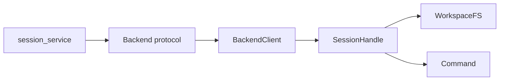

# Backends Package

Backends isolate the execution substrate. Today the concrete backend is
Sprites, but the rest of the session service talks to protocols.

## Files

- `base.py` defines protocols for backend client, session handle, workspace
  filesystem, commands, and network policy objects.
- `sprites.py` adapts the Sprites SDK to those protocols.
- `registry.py` constructs and returns named backend implementations.

## Contract

If a backend cannot be configured because credentials are absent, it should be
missing at `get_client()` time so `/sessions` can fail fast with `503`.
