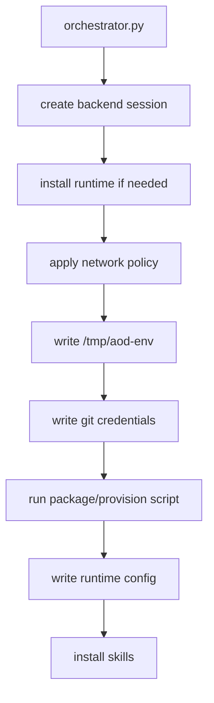

# Provisioning Package

Provisioning prepares a backend session before the first runtime turn. It is
run by the worker, not the web request.

## Files

- `orchestrator.py` owns create/resume/destroy and ordered provisioning.
- `stages.py` implements each stage and wraps failures in `ProvisionError`.
- `events.py` emits stage logs that clients can stream.
- `env_file.py` renders environment variable exports.
- `git_credentials.py` renders private repo credentials.
- `network_policy.py` converts environment networking config to backend policy.
- `package_commands.py` renders package-manager install commands.
- `script.py` builds the main setup script.
- `post_script_dirs.py` finds directories that must exist after setup scripts.
- `skills_install.py` renders `skills.sh` installation commands.

## Debugging Tip

When a session fails before runtime output appears, inspect `stage` events and
stderr logs first. The failure likely happened in this package.
