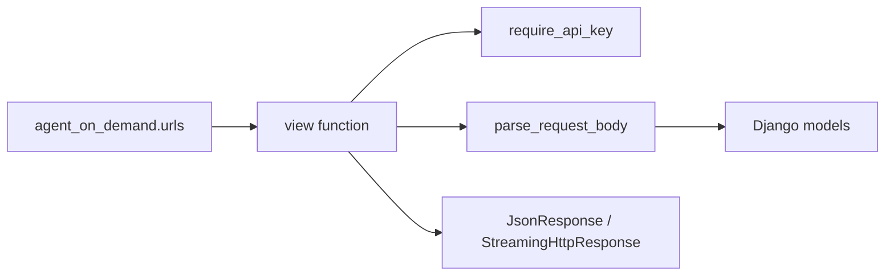

# Views Package

The views package is the REST API boundary. Views authenticate the caller,
parse JSON into pydantic request models, enforce ownership, mutate models, and
return JSON.

## Route Families

- `agents.py`: create/list/detail/update/archive/version history for agents.
- `environments.py`: create/list/detail/update/archive/delete/version history
  for environments.
- [`sessions/`](sessions/README.md): create/list/detail/prompt/turns/terminate
  /delete/stream for sessions.
- `health.py`: deployment health check for DB and crypto.
- `_helpers.py`: shared JSON parsing into pydantic models.

## Index

- [`sessions/`](sessions/README.md) — session create, lifecycle, turns, and
   SSE streaming.

## Flow

## Conventions

- Return `404` when a row is missing or belongs to a different user.
- Return `409` for archived rows, stale versions, or invalid lifecycle states.
- Return `422` for schema or compatibility errors.
- Keep long-running work out of the request path by deferring worker tasks.
