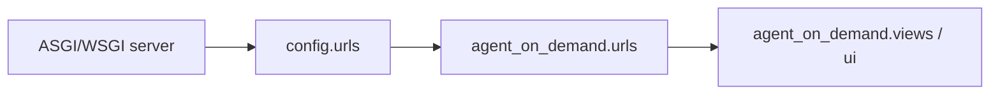

# Config Package

`config` is the Django project package. It contains deployment-level wiring,
not product behavior.

## Files

- `settings.py` defines installed apps, middleware, DB, static files, auth
  redirects, Procrastinate, Sprites, quotas, and observability settings.
- `urls.py` mounts Django admin and includes `agent_on_demand.urls` at root.
- `asgi.py` and `wsgi.py` expose application objects for async and WSGI
  servers.

The Django app is imported as `agent_on_demand` but has the app label `fairy`
in `AgentOnDemandConfig`; migrations and some Django internals use that label.

## Request Path

